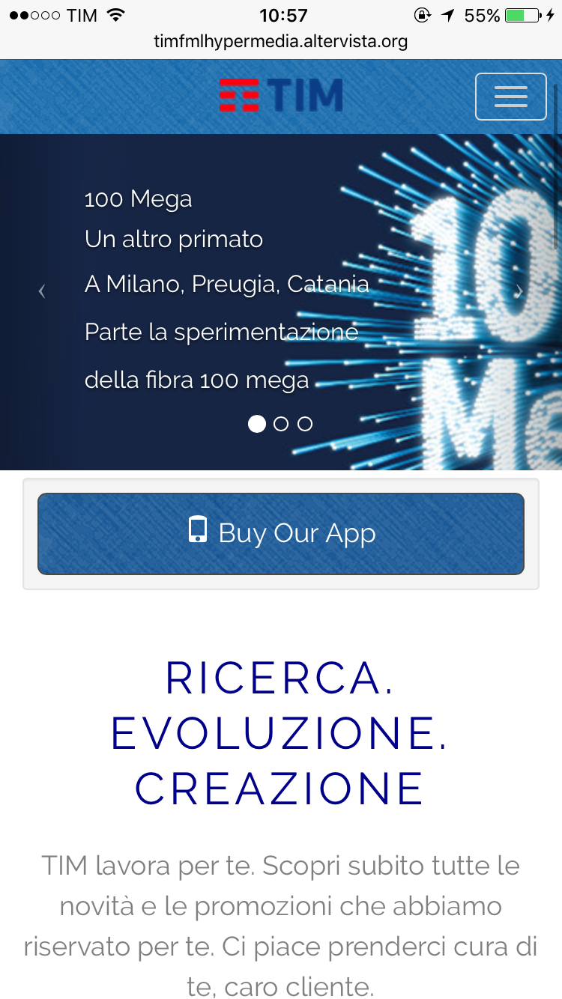
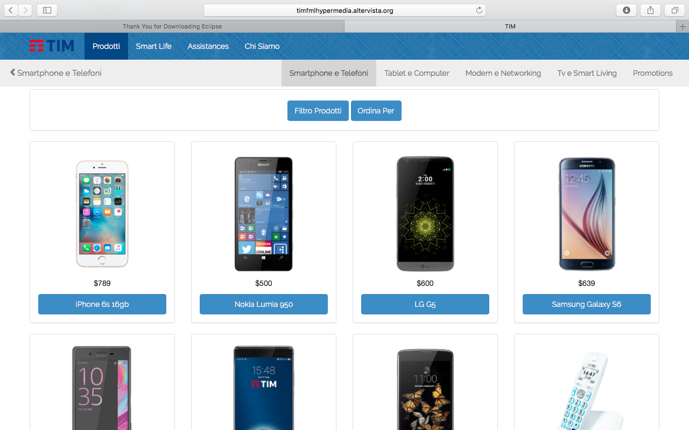

# Hypermedia-Project

The repository contains the project did for the Hypermedia Course at @Polimi (Politecnico di Milano - EIT Data Science Master Programme). 

## The Team

The team was composed by Marzia Degiorgi, Lorenzo Martini and Filippo Pedrazzini.

## Objective

The aim of the course was to rebuild the TIM  Dynamic Website starting from skratch.

## Implementation tools

In order to mimic a professional website, we used different programming languages such as: HTML, CSS, PHP and Javascript. While for the designing part we used the Bootstrap Framework.

## The website

Here the link to the website with some screenshots.

http://timfmlhypermedia.altervista.org

